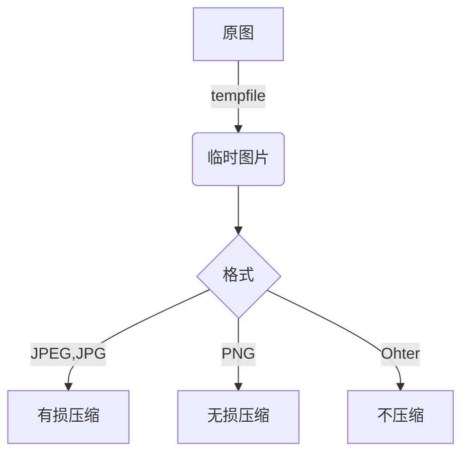

Typora插入图片时可以将其自动上传到图床中，在之前的文章中介绍了使用`PicGO`作为上传服务。



然而，在我实际使用中感觉`PicGO`稍微‘臃肿’，设置有时会卡死。

Typora支持图片上传服务使用自定义命令，简单描述即**上传图片时，Typora会自动运行设置的自定义命令，并将图片路径作为参数传递**。因此，我们可以使用电脑中存在的工具进行自定义该服务，例如`Python、GO、Nodejs`等。

## 1 图片上传服务--Python

从Typora命令执行逻辑分析，脚本的任务就是根据图片路径上传这些图片，然后将返回的图床 URL 输出到控制台，Typora 会自动用这些 URL 替换掉原来的本地路径。

:one: 配置文件

写图床存在需要权限，我们将认证信息独立到配置文件中：`config.json`

```json
{
  "access_key": "YOUR_ACCESS_KEY",
  "secret_key": "YOUR_SECRET_KEY",
  "bucket_name": "YOUR_BUKCET_NAME",
  "domain": "YOUR_DOMAIN",
  "path": "YOUR_PATH",
  "compress": true,
  "quality": 80
}
```

:two: 读取配置文件

```python
def load_config():
    """加载配置文件"""
    config_path = os.path.join(os.path.dirname(os.path.abspath(__file__)), 'config.json')
    try:
        with open(config_path, 'r') as f:
            return json.load(f)
    except FileNotFoundError:
        print("错误：找不到配置文件 config.json")
        sys.exit(1)
    except json.JSONDecodeError:
        print("错误：配置文件 config.json 格式不正确")
        sys.exit(1)
```

:three: 编写上传逻辑

上传到指定图床需要使用图床官方SDK，详细查看图床文档。以七牛`Python SDK`为例。

```python
# 安装七牛SDK
pip install qiniu
```

上传：

```python
def upload_to_qiniu(access_key, secret_key, bucket_name, domain, file_to_upload, original_filename, remote_path=""):
    """上传单个文件到七牛云"""
    # 构建鉴权对象
    q = Auth(access_key, secret_key)

    # 使用原始文件名构建在七牛云上保存的 key
    key = f"{remote_path}{original_filename}" if remote_path else original_filename

    # 生成上传 Token
    token = q.upload_token(bucket_name, key, 3600)

    # 上传处理后（可能被压缩）的文件
    ret, info = put_file(token, key, file_to_upload)

    if ret is not None and ret['key'] == key:
        # 上传成功，返回 URL
        # 确保域名末尾没有 /，路径开头没有 /
        return f"{domain.rstrip('/')}/{key.lstrip('/')}"
    else:
        # 上传失败
        print(f"上传失败: {info}")
        return None
```

:four: 扩展功能

在上传图片到图床前，我们可以对其进行压缩、添加水印等操作。这里以压缩功能为例。

```shell
# 使用Pillow提供的功能进行压缩
pip install Pillow
```

压缩：



```python
def compress_image(file_path, quality=80):
    """压缩图片，保持原格式，并返回临时文件路径"""
    try:
        img = Image.open(file_path)
        original_format = img.format or 'JPEG' # 如果格式未知，默认为JPEG
        
        # 获取原始文件扩展名
        _, ext = os.path.splitext(file_path)
        if not ext: # 如果没有扩展名，根据图片格式来定
            ext = f".{original_format.lower()}"

        # 创建一个与原文件同扩展名的临时文件
        temp_fd, temp_path = tempfile.mkstemp(suffix=ext)
        os.close(temp_fd)

        # 根据不同格式应用不同压缩参数
        save_options = {}
        if original_format in ['JPEG', 'JPG']:
            save_options['quality'] = quality
            save_options['format'] = 'JPEG'
        elif original_format == 'PNG':
            save_options['optimize'] = True # 无损压缩
            save_options['format'] = 'PNG'
        else: # 其他格式（如GIF, WEBP等）直接保存
            save_options['format'] = original_format

        img.save(temp_path, **save_options)
        return temp_path
    except Exception as e:
        print(f"压缩图片失败: {e}")
        # 如果压缩失败，返回原图路径，避免上传中断
        return file_path
```

只支持`JPEG、JPG、PNG`压缩。且压缩质量只对`JPEG、JPG`生效，有损压缩。而`PNG`采用无损压缩。

:five: 完整代码



## 2 Typora配置

`文件->偏好设置`，选择`图像`，上传服务选择`Custom Command`，命令`python "your_local_path\typora-uploader.py"`。


配置完成后，可以点击`验证图片上传选项`，它会上传两张默认图像进行测试。

:tada:Congratulations! Typora自定义上传服务配置完成。

