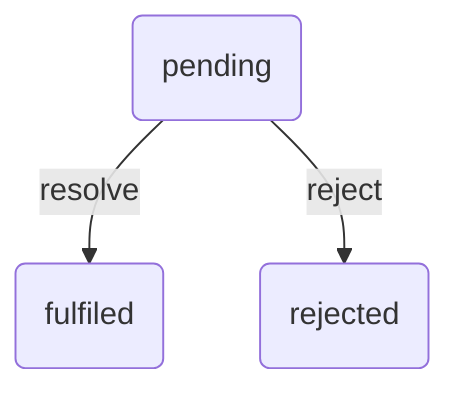

# Javascript学习笔记

## 1 异步Javascript

### 1.1 基于回调的异步

> 最基础的异步方式。

- 定时器

  一定时间后执行某个函数

  ```js
  /**
   * param 1: function
   * param 2: delayed time (ms)
   */
  setTimeout(() => console.log('定时调用'), 5000);
  ```

  ```js
  /**
  * setTimeout只调用一次回调函数
  * 如果要重复执行定时器，采用setInterval
  */
  let customIntervalId = setInterval(() => console.log('定时调用'), 1000);  // 每个1s调用一次
  setTimeout(() => clearInterval(customIntervalId), 5000);  // 5s后清除该setInterval
  ```

- 事件

  ```js
  // eg: click事件
  let blockElement = xxx;
  blockElement.addEventListener('clike', yourCallBack());
  ```

  

### 1.2 Promise

> 一种为简化异步编程而设计的核心语言特性。（可以理解为Promise是一种简化的处理回调的方式。为什么需要简化：例如，普通回调方式如果出现多重嵌套回调）。

> Promise是一个**表示异步操作结果（完成/失败）的对象**。Promise表示一次异步计算的未来结果。
>

> Promise标准化了**异步错误处理**。
>

#### 1.2.1 Promise基本使用

Promise具有三种状态：

:one: pending

:two: fulfilled

:three: rejected



##### 1 创建Promise


构造函数`Promise()`接收**一个函数作为唯一参数**，使用该函数对创建的Promise进行控制，该函数接收两个参数（通常名为resolve和reject，均为函数）。

```js
// 构造函数调用传入的函数，并为resolve和reject传入对应的函数值
const myPromise = new Promise((resolve, reject) => {
    // 异步执行逻辑...
    
    if (/*操作成功*/) {
        // 将 Promise 状态改为 fulfilled
        resolve(/*成功的返回结果*/);
    } else {
        // 将 Promise 状态改为 rejectes
        reject(/*失败的返回结果*/);                      
    }
});
```

##### 2 使用Promise

:one: `then()`：用于指定 Promise 状态变为 fulfilled 或 rejected 时的回调函数

```js
myPromise.then(
    res => {
        console.log(`Success: ${res}`);
    },
    err => {
        console.log(`Error: ${err}`);
        
    }
);
```

:two: `catch`：专用于处理 Promise 被拒绝的情况

```js
myPromise.then(res => {
    console.log(`Success: ${res}`);
}).catch(err => {
    console.error(`Caught error: ${err}`);
});

// 当then处理了error同时也使用catch时，仅then中的回调函数执行
myPromise.then(
    res => {
        console.log(`Success: ${res}`);
    },
    err => {
        console.log(`Error: ${err}`);	// 执行
    }
).catch(err => {
    console.error(`Caught error: ${err}`);	// 未执行
});
```

:three: `finally`：无论Promise最终处于什么状态均执行

```js
myPromise.then(res => {
    console.log(`Success: ${res}`);
}).catch(err => {
    console.error(`Caught error: ${err}`);
}).finally(() => {
    console.log('Promise settled (either resolved or rejected)');
});
```

### 1.3 async/await

> 虽然 Promise 改善了回调问题，但 then() 链式调用仍然不够直观。ES2017 引入了 async/await，它建立在 Promise 之上，让异步代码看起来像同步代码一样。

:one: async：在函数声明前添加 async 关键字，表示该函数是异步的

```js
async function fetchData() {
  // 函数体
}
```

:two: await：只能在 async 函数内部使用

await 会暂停 async 函数的执行，等待 Promise 完成：

- 如果 Promise 被 resolve，返回 resolve 的值
- 如果 Promise 被 reject，抛出错误（可以用 try/catch 捕获）

```js
async function showMessage(value) {
    try {
        const result = await new Promise((resolve, reject) => {
            // Simulating some asynchronous operation
            const x = value;
            setTimeout(() => {
                if (x > 0) {
                    resolve('Promise resolved successfully');
                } else {
                    reject('Promise rejected');
                }
            }, 5000);
        });
        console.log(result);
    } catch (error) {
        console.error(error);
    }
}

showMessage(5);		// Promise resolved successfully
showMessage(0);		// Promise rejected
```

